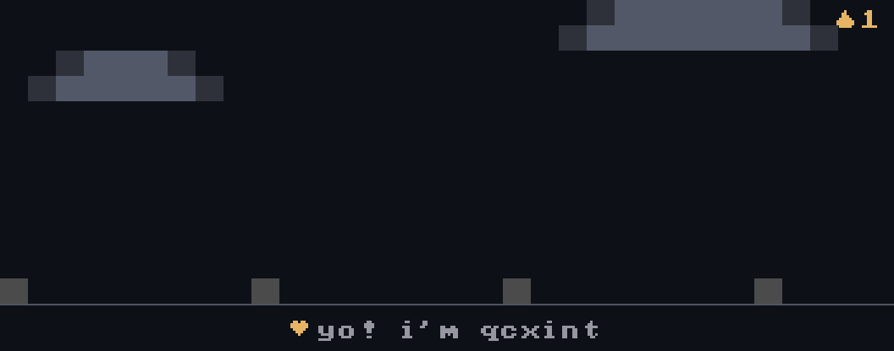

<!--
  Profile README for qcxint-crypto.
  awan.gif is generated from awan.json via .github/workflows/awan.yml
-->

<div align="center">



<br/>


<br/>

<a href="https://github.com/qcxint-crypto">
  
</a>
&nbsp;
<a href="https://t.me/anakmudabisakaya_airdrop">
  
</a>
&nbsp;
<a href="https://x.com/qcxint_">
  
</a>

</div>

---

### about

```text
handle   : qcxint-crypto
role     : crypto builder · bot crafter · airdrop hunter
stack    : Python · Node · Rust · automation
location : Kepler-452b
status   : shipping bots, farming seasons, breaking things
```

- currently shipping automation & airdrop tooling
- open to collab on bots, scrapers, chain scripts
- find me on telegram / X

---

### stats

<div align="center">


<br/>


</div>

---

### support

If you like the bots or scripts and want to support (no pressure), send here:

| chain | address |
|:------|:--------|
| **BTC** | `1MPoc8x5sCpcQWitZBqXHLbDWhCH63LSxe` |
| **ERC-20** | `0x59dcbc004570d6fa3e7e79fed6966818020c2c5a` |
| **TRC-20** | `TYBVhjCd4cELdRX49GLA5MgiRgkJC1WVvM` |
| **SOLANA** | `CBPDerYvymhQVgtUY1TkwATiKxRCbgBB8cvMLXqeMUSE` |

Indo? [saweria.co/rananwari](https://saweria.co/rananwari) · thank you

---

<div align="center">


<sub>powered by <a href="https://github.com/codewithwan/awan">awan</a> · loop regenerates on push to <code>awan.json</code></sub>

</div>
